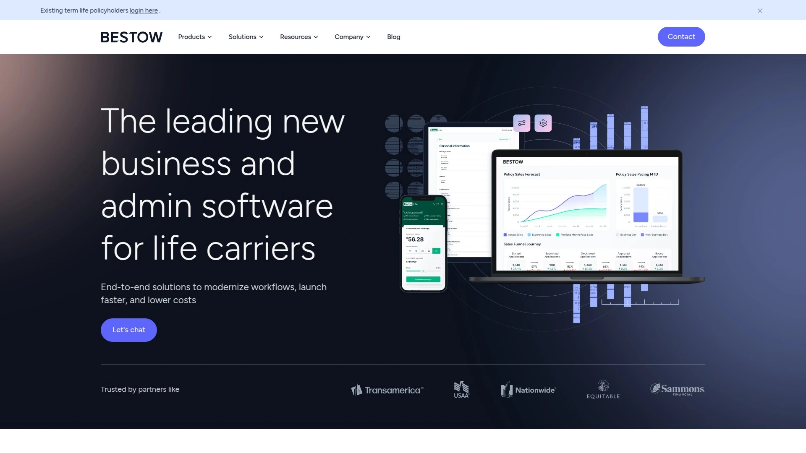
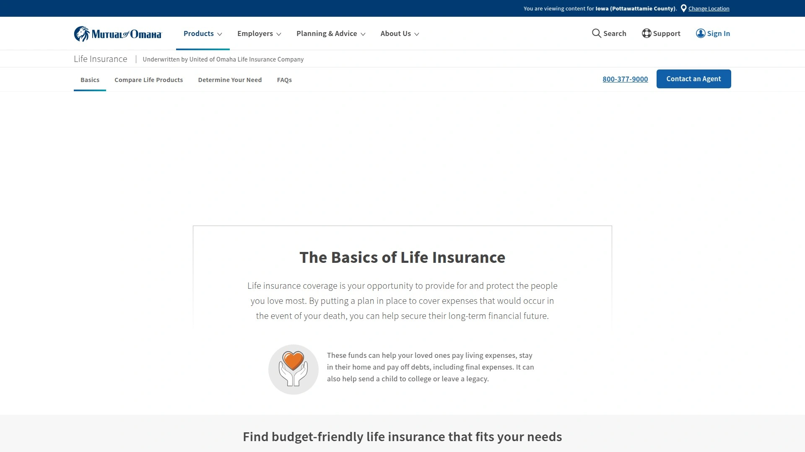

# Top 18 Online Life Insurance Platforms Ranked in 2025 (Latest Update)

Buying life insurance used to mean sitting through awkward meetings with pushy salespeople, scheduling medical exams, and waiting weeks for approval. Not anymore. The digital insurance revolution has transformed how families get covered—now you can compare quotes, skip the needles, and get approved in minutes, all from your couch in your pajamas.

If you're shopping for fast, hassle-free coverage to protect your family's financial future, you're in the right spot. These platforms cut through the complexity with instant quotes, simplified applications, and coverage that starts as quickly as the same day.

## **[Ethos](https://www.ethos.com)**

The instant-decision specialist that gets you covered before your coffee gets cold.

Ethos has cracked the code on what people actually want: speed without the runaround. Their proprietary underwriting engine reads your information in real-time and spits out instant decisions for most applicants between ages 20 and 65. No medical exam needed for coverage up to three million dollars—just answer some health questions online and you could be insured within ten minutes.

The platform partners with established carriers like Mutual of Omaha and Legal & General America, so you're getting rock-solid coverage from names that have been around the block. Term lengths run from 10 to 30 years with coverage starting at twenty thousand and climbing to three million, depending on what you qualify for. Everyone gets a free will and estate planning tools (an eight-hundred-ninety-eight-dollar value) thrown in with their policy.

What sets Ethos apart is how they handle older applicants. If you're 65 to 85, they offer guaranteed issue whole life policies—no exam, no health questions, just straightforward coverage from ten thousand to twenty-five thousand dollars. The application lives entirely online, with 4.8 stars from over twenty-five hundred Trustpilot reviews backing up their hassle-free reputation.

## **[Ladder Life](https://www.ladderlife.com)**

The flexibility champion that lets you adjust coverage as life changes.

Ladder built their entire platform around one insight: your insurance needs aren't static. Maybe you just paid off a chunk of mortgage, or your kid finished college—why keep paying for coverage you don't need? With Ladder, you can decrease your policy or apply to increase it online in just a few clicks, no strings attached.

The digital application takes about five minutes, and many customers get instant decisions for coverage up to three million dollars without a medical exam. If you need more than three million (up to eight million total), they might ask for a quick at-home health check, but even that beats the traditional route. Terms range from 10 to 30 years, with coverage starting at one hundred thousand.

Ladder's rates are competitive too—they've heard from customers who applied while literally standing in line at the grocery store and walked out with a policy approved. Your premiums stay locked for the term you choose, and the 100% digital experience means no paperwork, no doctors, no needles for most applicants.

## **[Haven Life](https://havenlife.com)**

The MassMutual-backed platform bringing modern simplicity to old-school reliability.

Haven Life operates as the digital arm of MassMutual, one of America's oldest insurers, which means you get startup convenience with established-company backing. They offer two distinct paths: Haven Term requires a medical exam in most cases but delivers broader coverage options, while Haven Simple is 100% exam-free for people aged 20 to 55.

Haven Simple is their streamlined offering with coverage from twenty-five thousand to one million dollars over terms of 5, 10, 15, or 20 years. The entire application happens digitally—no phone calls, no exams, just straightforward questions. If approved, coverage begins immediately.

What makes Haven Life interesting is their Haven Life Plus rider, which gives eligible policyholders over seven hundred dollars a year in no-cost benefits: online will creation, fitness app membership, end-of-life planning tools, and a secure document vault. A two-hundred-fifty-thousand-dollar, 20-year Haven Term policy starts at just fourteen-ninety-nine per month.

## **[Bestow](https://www.bestow.com)**

The algorithmic underwriter delivering decisions in minutes, not weeks.

Bestow runs on pure algorithms—there's no waiting for doctors to send records or underwriters to review your file. You answer health questions online, their system crunches the data, and boom—instant decision for most applicants aged 18 to 60. Coverage ranges from fifty thousand to one-point-five million dollars over terms of 10, 15, 20, 25, or 30 years.

The platform specializes in simplified issue term life, meaning no medical exam required for anyone. Policies start at just ten dollars per month, making them accessible for tight budgets. Bestow's underwriting algorithm pulls from prescription history and public records rather than requiring invasive testing, which speeds everything up dramatically.

Every policy includes a 30-day money-back guarantee—if you're not satisfied, cancel within the first month for a full refund. Bestow currently operates in every state except New York, with policies issued by North American Company for Life and Health Insurance, which carries an A+ rating from A.M. Best.

## **[Fabric by Gerber Life](https://meetfabric.com)**

The new-parent favorite with instant approval and zero sales pressure.

Fabric (now operating as Fabric by Gerber Life under the Western & Southern Financial Group umbrella) designed their platform specifically for busy parents who don't have time for lengthy applications. Their accelerated underwriting system can instantly approve eligible applicants with no medical exam—some customers report getting coverage approved in under ten minutes.

Term lengths run from 10 to 30 years with coverage amounts between one hundred thousand and five million dollars. The digital application is completely self-service with no sales calls, which is refreshing if you've ever dealt with pushy insurance agents. Prices start as low as seven-eighty-five per month depending on age and health.

Fabric also offers a unique "Instant" product—accidental death coverage you can get in about two minutes, starting at just six dollars monthly for one hundred thousand in coverage. For people aged 25 to 44 (where accidental death is a leading cause of mortality), it's quick peace of mind while you figure out fuller coverage.

## **[Policygenius](https://www.policygenius.com)**

The comparison marketplace that shows you quotes from dozens of insurers at once.

Policygenius isn't an insurance company—it's a broker that lets you compare policies from over 30 top-rated carriers side by side. This is huge because rates for the same coverage can vary wildly between insurers. One real example: a 33-year-old male in New York shopping for a one-million-dollar, 20-year term saw quotes ranging from thirty-three-ninety to sixty-one-sixty-nine per month—that's a 45% difference for identical coverage.

The platform offers term, whole, universal, and no-exam options spanning 10 to 40 years in five-year increments. You enter basic information once, then drill into detailed comparisons with premium estimates from multiple carriers. Licensed agents are available to answer questions, but unlike traditional brokers, Policygenius doesn't sell your information to third parties.

Their comparison engine helps you find policies with coverage up to ten million dollars across carriers like Prudential, Legal & General, Pacific Life, and Principal. Many applicants can get no-exam policies instantly approved, though some carriers require more documentation.

## **[Legal & General America](https://www.lgamerica.com)**

The high-coverage specialist offering up to four million without an exam.

Legal & General America (operating through Banner Life and William Penn) is one of the few insurers willing to underwrite massive policies without medical exams for qualified applicants. If you're aged 20 to 60 in good health, you can apply for up to four million dollars in coverage—73% of their term life applicants get approved with no exam, and 42% receive instant decisions.

Term lengths range from 10 to 40 years with premiums starting as low as eight dollars monthly. Legal & General has been in business since 1836 and currently protects over 1.4 million Americans. They're part of a global financial services company managing eighty-eight billion in assets.

The company consistently receives fewer complaints than expected for their size according to NAIC data, and they hold an A+ financial strength rating from A.M. Best. Their online application process handles everything digitally for most applicants, though some may need a phone interview depending on coverage amount and health profile.

## **[Lemonade Life](https://www.lemonade.com/life)**

The AI-powered disruptor making life insurance feel like ordering takeout.

Lemonade entered the life insurance space with the same disruptive energy they brought to renters and homeowners coverage—everything happens through an AI chatbot named Maya who guides you through the application. It's conversational, fast, and weirdly enjoyable for something as traditionally boring as buying life insurance.

The platform offers term lengths of 10, 15, 20, 25, 30, 35, or 40 years with coverage starting at one hundred thousand and climbing into the millions. Most applicants aged 20 to 75 won't need a medical exam, and qualifying policies can be issued within minutes for same-day coverage. Rates are competitive—a 30-year-old can get five hundred thousand in 20-year coverage for around eighteen to twenty-three dollars monthly.

Lemonade's policies are issued by Legal & General America, which draws fewer than expected complaints for a company their size. Optional riders include accelerated death benefit for terminal illness, children's coverage, term rider for extra protection, and waiver of premium if you become disabled.

## **[Mutual of Omaha](https://www.mutualofomaha.com/life-insurance)**

The senior-friendly veteran with guaranteed issue options up to age 85.

Mutual of Omaha has been insuring Americans since the 1800s, and they've adapted well to the digital age without losing their senior-focused expertise. They're particularly strong for older applicants—their guaranteed whole life insurance accepts people aged 45 to 85 (50 to 75 in New York) with no medical exams and no health questions.

For younger, healthier applicants, Mutual of Omaha offers term life up to two hundred fifty thousand for those 60 and below, or one hundred fifty thousand for ages up to 70, all with no exam required. Their permanent policies build cash value at a fixed 5.66% interest rate that you can borrow against—though any outstanding loan reduces your death benefit.

The guaranteed issue whole life is especially popular for final expense coverage, with policies from ten thousand to forty thousand designed to cover funeral costs and medical bills. Most claims are paid within 24 hours, and every policy includes a 30-day money-back guarantee.

## **[Nationwide](https://www.nationwide.com)**

The multi-product giant with 70% of applicants skipping the exam.

Nationwide leverages their massive infrastructure to offer one of the widest ranges of no-exam life insurance products: term, whole, universal, indexed universal, and variable universal. Their Life Essentials term policy is available for ages 21 to 55 with coverage from two hundred fifty thousand to one-point-five million.

Here's where Nationwide gets interesting: they use intelligent underwriting that pre-screens applicants using digital health records. About 70% of people aged 18 to 50 applying for one hundred thousand to five million (or ages 51 to 60 applying for up to one million) can bypass the exam entirely. The system pulls your medical data, evaluates risk, and routes healthy applicants straight through.

The company holds an A+ financial strength rating from A.M. Best and ranked in the top five for customer experience in J.D. Power's 2024 Individual Life Insurance Study. Premiums for their no-exam Life Essentials policy start around fifteen dollars monthly.

## **[Pacific Life](https://www.pacificlife.com)**

The flexible underwriter with terms stretching to age 70.

Pacific Life offers some of the most accommodating rules for no-exam term life, accepting applicants from age 18 to 70 with coverage between fifty thousand and three million dollars. If you're under 60, you'll complete a health interview to determine exam eligibility—most people with clean health profiles sail through without one.

For applicants aged 60 to 70 or those with additional medical conditions, Pacific Life may request an attending physician statement (APS) to review your health records before waiving the exam requirement. This middle-ground approach helps more people qualify than strict age cutoffs at other insurers.

Pacific Life's term policies include conversion privileges, accelerated death benefits for terminal illness, and optional riders for enhanced flexibility. The company carries strong financial ratings and has been protecting families for over 150 years, though they work primarily through financial professionals rather than direct-to-consumer.

## **[Symetra](https://www.symetra.com)**

The swift-approval specialist with instant, accelerated, or full underwriting paths.

Symetra's SwiftTerm and SwiftProtector products live up to their names—eligible applicants can get instant coverage in as little as 25 minutes. The platform offers three approval pathways depending on your situation: instant coverage for those who qualify immediately, accelerated underwriting taking one to three days, or full underwriting with a medical exam up to 30 days for complex cases.

SwiftTerm provides term life coverage with flexible lengths and amounts up to three million dollars. The included accelerated death benefit for terminal illness lets you access up to 75% (five hundred thousand maximum) of your policy if a physician certifies you have less than 12 months to live. Every policy includes partnership with Empathy to help beneficiaries navigate grief and estate settlement.

Symetra also offers SwiftProtector—permanent indexed universal life insurance with the same fast digital process. It builds cash value through index strategies you can access during your lifetime while providing guaranteed death benefit protection as long as premiums are paid.

## **[State Farm](https://www.statefarm.com/insurance/life)**

The bundling king with local agents and digital convenience.

State Farm brings their massive agent network (19,000 agents across the country) to life insurance with both in-person and online quote capabilities. While they're best known for auto and home coverage, their life insurance operation is substantial—they ranked as the top choice for customer satisfaction and financial stability in multiple industry studies.

The company offers term, whole, and universal life insurance with flexible payment options. You can use their online calculator to estimate coverage needs, then either work with a local agent for personalized service or handle everything digitally. Many applicants can skip the medical exam depending on age, health, and coverage amount.

State Farm's Life Enhanced program offers eligible policyholders rewards and benefits for healthy living, though availability varies by state—Florida, New York, and South Dakota residents can't access the full program currently. The bundling discounts are real though: combining life with auto or home insurance can save significant money compared to separate policies.

## **[Penn Mutual](https://www.pennmutual.com)**

The comprehensive choice offering accelerated underwriting on all products.

Penn Mutual earned recognition as the best overall no-exam provider for good reason—they'll waive the exam requirement for eligible applicants applying for up to ten million dollars in coverage, including permanent life insurance policies. That's significantly higher than most competitors cap their no-exam offers.

The company has operated as a mutual insurer since 1847, meaning policyholders are essentially owners who share in the company's success. Penn Mutual holds an A+ financial strength rating from A.M. Best for 98 consecutive years—a testament to rock-solid stability. They also have one of the lowest customer complaint rates among life insurers researched.

Penn Mutual's recently refreshed Accelerated Client Experience (ACE) platform modernizes the application process with faster, simpler, more seamless digital interactions. Eligible whole life policyholders receive dividends paid at historically high interest rates.

## **[Amica](https://www.amica.com/en/products/life-insurance.html)**

The customer-service champion with over a century of award-winning claims support.

Amica combines old-fashioned service excellence with modern convenience—they've been insuring Americans for over 100 years while maintaining award-winning claims and customer service operations. Their life insurance products include term and whole life with coverage ranging from twenty-five thousand to over twenty million dollars.

Term options span 10, 15, 20, 25, or 30 years with level premiums that never increase during the term. Many applicants can skip the medical exam by completing a health questionnaire instead. All policies include an accelerated benefits rider for terminal illness at no extra charge.

Amica's whole life offerings include three payment structures: Whole Life 20 (pay for 20 years), Whole Life 65 (pay until age 65), or Whole Life 100 (pay to age 100), each designed for different goals and budgets. Bundling life insurance with Amica auto coverage saves up to 10% on your auto premiums. Plus, policyholders get access to the Empathy app for grief support when beneficiaries need it most.

## **[Transamerica](https://www.transamerica.com/individual/insurance/overview)**

The long-standing giant with 120 years backing diverse life insurance products.

Transamerica has been helping Americans protect their families for over 120 years, managing four hundred sixteen billion in assets as of December 2024. They offer the full spectrum: term life for budget-conscious families, index universal life (IUL) for those wanting cash value growth tied to market indices, whole life for guaranteed lifelong coverage, and final expense insurance for end-of-life costs.

Their term life provides straightforward coverage for specific periods—usually 10 to 30 years—with federal income-tax-free death benefits if you pass during the term. The permanent options build cash value with tax-deferred interest, giving you assets you can tap during your lifetime through loans or withdrawals.

Transamerica's digital experience launched in July 2024 with My Life Access, giving policyholders 24/7 online access to policy information, values, transactions, beneficiary details, and service requests. You can make payments, track policy changes, and access all documents in one convenient portal.

## **[Principal Financial](https://www.principal.com)**

The employee-benefits powerhouse extending coverage to individuals and families.

Principal Financial Group started in 1879 as Bankers Life Association and has grown into a Fortune 500 company with over 18,600 employees worldwide and one hundred forty-four-point-nine billion in assets. While they're massive in the group employee benefits space, they also offer individual term and permanent life insurance through financial professionals.

Their group term life insurance for employees includes flexible benefits structures—flat amounts, percentage of salary, or increments that employees can customize. Coverage reaches up to one million for employer-paid plans and five hundred thousand for voluntary employee-paid policies. Many plans include extras like travel assistance, online will creation tools, identity theft kits, and emotional health support lines at no additional cost.

Principal holds an A+ rating from A.M. Best and A+ from Standard & Poor's, with strong financial strength grades across all major rating agencies. Their customer service operates Monday through Friday, 7 a.m. to 7 p.m. Central Time at 800-986-3343.

## **[SBLI](https://www.sbli.com)**

The direct-to-consumer pioneer offering maximum death benefits at minimum cost.

SBLI (Savings Bank Life Insurance) has been providing affordable coverage since 1907 with a straightforward philosophy: cut out the middleman to deliver lower premiums. Their term life insurance offers coverage from one hundred thousand up to five million dollars over 10, 15, 20, 25, or 30-year terms.

SBLI Simple Term is their accelerated product for ages 18 to 55, with no medical exam required—just quick health questions and a decision in minutes. Coverage tops out at one million for ages 18 to 50, or five hundred thousand for ages 51 to 55. Their full SBLI Term product can require a medical exam but extends coverage options significantly higher.

Every policy includes a LegacyShield subscription—digital tools to help build and protect your legacy through secure document storage and planning resources. SBLI whole life insurance builds cash value you can borrow against, pays potential dividends, and guarantees lifetime protection with premiums that never increase. They hold an A rating from A.M. Best and A+ from the Better Business Bureau.

## **[TruStage](https://www.trustage.com)**

The credit-union specialist protecting over 35 million consumers nationwide.

TruStage operates through close relationships with more than 3,200 credit unions across America, offering members personalized coverage designed to fit monthly budgets. They provide term, whole, and guaranteed acceptance whole life insurance underwritten by CMFG Life Insurance Company, which carries an A (Excellent) rating from A.M. Best as of December 2024.

Their guaranteed acceptance whole life insurance accepts applicants with no medical exam and no health questions—perfect for people with health conditions that make other coverage difficult to find. Coverage begins immediately after your first payment clears, with locked-in rates that never increase. The simplified application process delivers instant decisions online through just a few questions.

TruStage whole life policies build cash value you can borrow against while your premiums stay fixed for life. The policy can't be canceled as long as you keep paying premiums, and coverage is designed to last your entire lifetime. You can apply online from your smartphone and get approved within minutes, with full refunds available if you're not satisfied within 30 days of your coverage start date.

## Common Questions About Online Life Insurance

**How fast can I actually get covered with these platforms?**

The speediest approvals happen through accelerated underwriting systems like Ethos, Bestow, and Ladder—eligible applicants often get instant decisions within 10 to 25 minutes. If you need a medical exam or the insurer requests additional records, expect one to four weeks. Guaranteed issue policies for seniors typically start coverage 30 days after your first payment clears.

**Will skipping the medical exam cost me more?**

Not necessarily. While traditional guaranteed-issue policies (aimed at older or sicker applicants) do charge higher premiums, modern accelerated underwriting uses data analytics to price policies competitively. Companies like Ethos and Legal & General can offer rates comparable to fully underwritten policies because they're still evaluating your risk—just through digital health records and prescription history instead of blood tests.

**What if I have a pre-existing health condition?**

Many no-exam platforms can still cover you depending on the condition and how well it's managed. Simplified issue policies ask detailed health questions and pull prescription records—if your condition is controlled and you're otherwise healthy, you may qualify. For serious conditions, guaranteed acceptance whole life from providers like Mutual of Omaha or TruStage offers coverage with no health questions, though at higher premiums and lower coverage amounts.

## Get Protected Now

Life insurance isn't something to put off—premiums increase about 10% every six months you wait once you're over 40, and your health can change unexpectedly. The good news is getting covered has never been easier or faster. **Ethos** stands out as the top choice for most people shopping online: their instant underwriting gets you covered quickly, their coverage amounts reach up to three million without exams, and the free estate planning tools add serious value beyond the policy itself. Whether you need fast approval, flexible coverage, or senior-friendly options, these platforms prove you don't need to suffer through traditional insurance headaches to protect your family's future.
